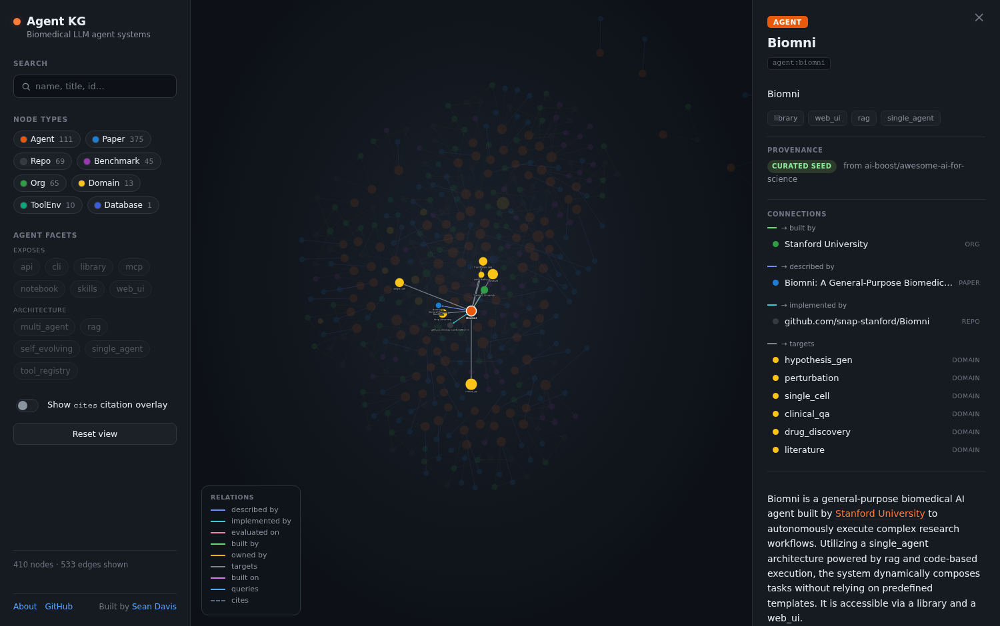
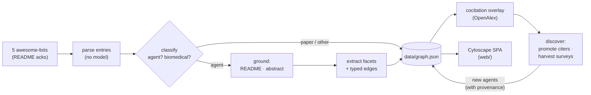

<div align="center">

# Biomedical Agent Knowledge Graph

**A generated, navigable catalog of LLM-based agent systems for biomedicine and
bioinformatics — and the papers, repos, benchmarks, orgs, tools, and databases that
connect them.**

[](LICENSE)
[](data/LICENSE)
[-3776AB.svg)](pyproject.toml)
[](web/)

<br>



</div>

---

The catalog is **fully generated** by a pipeline (`agentkg`) that crawls curated lists,
classifies and grounds each system in real text, extracts a typed graph, and then **grows
itself beyond the lists** by mining the citation network. Every node records its
provenance, so the whole thing is auditable and reproducible. The result is a static
`data/graph.json` rendered by a single-page Cytoscape app.

> **Agents are the spine.** You *traverse through* nodes (papers, repos, benchmarks,
> orgs, tool collections, databases) and *filter on* attributes (license, stars,
> architecture). See [`SPEC.md`](SPEC.md) for the full data model.

## Snapshot

A generated artifact — these numbers move as the pipeline re-runs (see `data/_provenance.json`).

| | |
|---|---|
| **Agents** | **111** — 69 from curated lists + 42 discovered via citations |
| Nodes / edges | 689 / 1120 (incl. a 587-edge citation overlay) |
| Other nodes | 375 papers · 69 repos · 65 orgs · 45 benchmarks · 13 domains · 10 tool envs · 1 database |
| Provenance | every agent tagged `awesome_list` / `cocitation` / `survey_harvest` |

## How it works



1. **Crawl & parse** — fetch five public awesome-lists, parse ~634 entries (no model).
2. **Classify** — an LLM decides `agent | benchmark | paper | other`, gated to *biomedical
   LLM-agentic systems* (foundation models, tools, and frameworks are filtered out).
3. **Ground** — pull each system's GitHub README or paper abstract so extraction reasons
   over real text, not titles.
4. **Extract** — a typed graph of facets (`exposes`, `architecture`) and edges
   (`described_by`, `implemented_by`, `evaluated_on`, `built_by`, `targets`, `built_on`,
   `queries`) with `{source, evidence}` provenance on the expensive ones.
5. **Citation overlay** — add `cites` edges and external papers that connect ≥2 catalog
   papers (default-off in the UI; it dominates layout).
6. **Discover** — promote external papers that cite ≥2 catalog agents, and **harvest the
   reference lists of surveys** the catalog cites. This grows the catalog past the lists.
   ([ADR 0003](docs/adr/0003-citation-based-agent-discovery.md) — and why this complements,
   rather than replaces, a keyword literature review.)

Everything model-touched produces *candidates*; deterministic vocab guards and class-level
rules canonicalize them before serialization. Fix the generator, never the record.

## Quickstart

**Pipeline** (uv-managed, Python ≥3.11):

```bash
uv sync
uv run agentkg run                  # mock backend, fully offline -> data/graph.json
uv run agentkg run -b vertex        # live Gemini extraction (needs creds; see .env.example)
uv run agentkg run -b vertex --sources -p 5   # crawl real lists, draft 5 profiles
```

**Web app** (bun + Vite + Cytoscape):

```bash
cd web && bun install && bun run dev    # mirrors data/ in, serves on :5173
```

## Repository layout

```
src/agentkg/   the pipeline (crawl · classify · ground · extract · cocite · discover)
data/          generated catalog — graph.json + agents/*.md + _provenance.json  (CC0)
web/           Vite + Cytoscape single-page app
docs/adr/      architecture decision records
SPEC.md        the data model (node/edge types, controlled vocabularies)
CLAUDE.md      operational guide for the pipeline
```

## Data, provenance & reproducibility

The catalog is assembled from public metadata: **OpenAlex** (citations, affiliations,
abstracts), **arXiv** (abstracts), and **GitHub** (READMEs, repo health). `data/_provenance.json`
records the run parameters and the OpenAlex access date; each node carries how it entered the
catalog. Re-running with the same seed lists and OpenAlex snapshot reproduces the graph
(modulo model nondeterminism, which the provenance and `_review.json` log make auditable).

## Licensing

- **Code** (`src/`, `web/`) — [MIT](LICENSE).
- **Data** (`data/`) — [CC0 1.0](data/LICENSE), public domain. The underlying papers,
  repositories, and databases remain under their own licenses.

## Acknowledgements

Seeded from these community-curated lists — thank you to their maintainers:

- [zhoujieli/Awesome-LLM-Agents-Scientific-Discovery](https://github.com/zhoujieli/Awesome-LLM-Agents-Scientific-Discovery)
- [AgenticScience/Awesome-Agent-Scientists](https://github.com/AgenticScience/Awesome-Agent-Scientists)
- [AgenticHealthAI/Awesome-AI-Agents-for-Healthcare](https://github.com/AgenticHealthAI/Awesome-AI-Agents-for-Healthcare)
- [ai-boost/awesome-ai-for-science](https://github.com/ai-boost/awesome-ai-for-science)
- [tsinghua-fib-lab/Awesome-AI-Scientists](https://github.com/tsinghua-fib-lab/Awesome-AI-Scientists)

Built on the open metadata of [OpenAlex](https://openalex.org), [arXiv](https://arxiv.org),
and [GitHub](https://github.com).

## Contributing

See [CONTRIBUTING.md](CONTRIBUTING.md). The golden rule: fix the generator, not the record.

---

<div align="center">

Built by **[Sean Davis](https://github.com/seandavi)** · [github.com/seandavi/biomedical-agent-kg](https://github.com/seandavi/biomedical-agent-kg)

</div>
